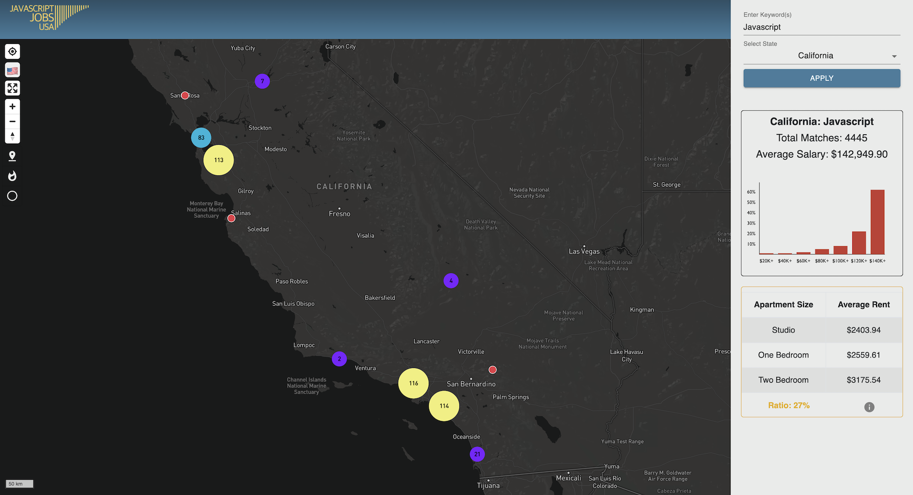
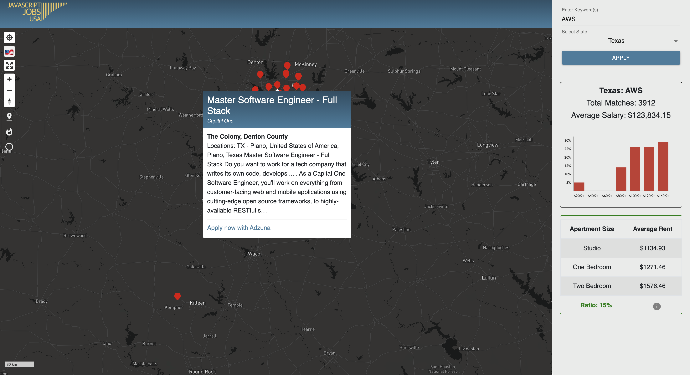

# Welcome to JavaScript Jobs USA


An interactive job search tool to find jobs for JavaScript developers by location. Custom search any US state for a developer job and see and apply to hundreds of real-time jobs plotted to the map in multiple view modes. JavaScript Jobs USA is a Progressive Web App (PWA) built using React, Redux, Node/Express, Mapbox, Redis, Adzuna Jobs API, and Google Place Search API. 

## <a href="https://www.youtube.com/watch?v=UNz9k9E9IWM"> Demo Video on YouTube </a>

## <a href="https://javascript-jobs-usa.herokuapp.com/"> Deployed on Heroku </a>
_App is hosted on a free Heroku server. Please allow 15-30 seconds for it to spin up. Also, we have limited Adzuna API queries. If app causes 500 error, please select state: California; filter: Javascript, to explore app with cached dummy data.

_





## Tech-Stack

Below is a non-exhaustive list of technologies used throughout the project.

<table>
      <thead>
        <tr>
          <th>Front End</th>
          <th>Back End</th>
          <th>APIs</th>
          <th>Libraries</th>
        </tr>
      </thead>
      <tbody>
            <tr>
              <td>React</td>
              <td>Node.js</td>
              <td>Adzuna</td>
              <td>PWA</td>
            </tr>
            <tr>
              <td>Redux</td>
              <td>Express</td>
              <td>Google Places</td>
              <td>Victory</td>
            </tr>
            <tr>
              <td>Mapbox GL</td>
              <td>Redis</td>
              <td></td>
              <td>Bootstrap</td>
            </tr>
      </tbody>
  </table>

## Setup

If you want to play around with JavaScript Jobs USA, feel free to clone our repo. To start, please enter the following commands on your terminal:

```
git clone https://github.com/2009-fsa-cs-ashes-archers/JobMapApp
cd JobMapApp
npm install
npm run start-dev
```
You'll need to run Redis server locally. To download Redis, run 'brew install redis' and 'redis-server'. For more information, go to this <a href="https://dzone.com/articles/a-brief-introduction-to-caching-with-nodejs-and-re">link</a>.

You will need to sign up for API keys with <a href="https://developer.adzuna.com/signup">Adzuna</a> and <a href="https://cloud.google.com/free">Google Cloud</a> and set them to process environment variables:

```
process.env.GOOGLE_PLACES_API_TOKEN
process.env.ADZUNA_API_KEY
process.env.ADZUNA_API_ID
```
* Just note, that each API has its own queries limitations.


## HIRE US!

In this project, we tackled huge engineering challenges including massive data-management and caching, promise-chaining, competing DOM/Virtual DOM references, flexible and mobile-friendly design pattern, and grew into ambitious, able developers!

<table>
      <thead>
        <tr>
          <th>Full Name</th>
          <th>GitHub</th>
          <th>LinkedIn</th>
        </tr>
      </thead>
      <tbody>
            <tr>
              <td>Daniel Berger</td>
              <td><a href="https://github.com/KungoJung">KungoJung</a></td>
              <td><a href="https://www.linkedin.com/in/danielberger18/">Daniel Berger</a></td>
            </tr>
            <tr>
              <td>Peter Boustani</td>
              <td><a href="https://github.com/boustanip718">boustanip718</a></td>
              <td><a href="www.linkedin.com/in/boustanip718">Peter Boustani<a/></td>
            </tr>
            <tr>
              <td>Agne Urbaityte</td>
              <td><a href="https://github.com/agne-ur">agne-ur</a></td>
              <td><a href="www.linkedin.com/in/urbaityteagne">Agne Urbaityte<a/></td>
            </tr>
      </tbody>
  </table>


